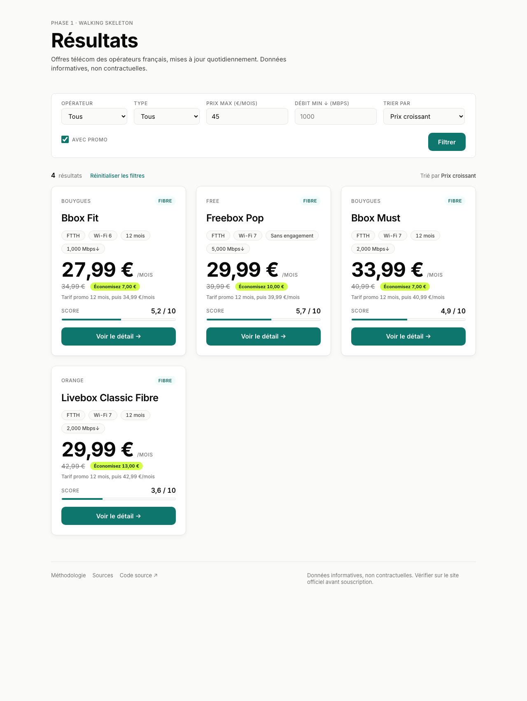
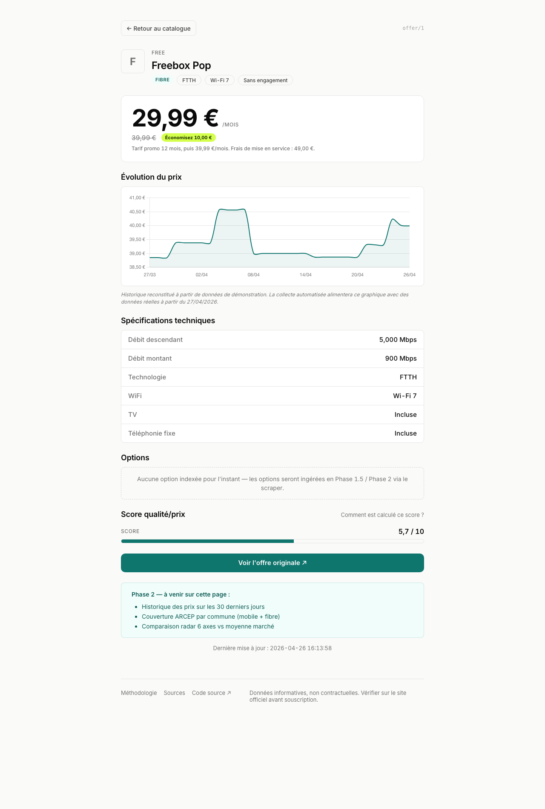
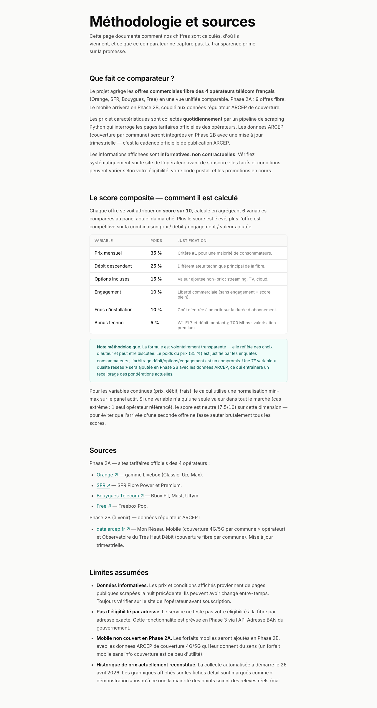

# Comparateur d'offres télécom FR

> Outil de veille qui agrège les offres commerciales des 4 opérateurs télécom français (Orange, SFR, Bouygues, Free) en fibre, calcule un score composite multidimensionnel par offre, et expose les données via une API REST + un site web responsive. Phase 2B prévue : enrichissement avec les données régulateur ARCEP (couverture mobile et fibre par commune).

**Pourquoi ce projet ?** Démontrer un pipeline data complet de bout en bout : scraping Python → BDD relationnelle MySQL → frontend PHP → API REST Flask. Le projet sert également de POC d'outil de veille télécom dans un contexte de conseil sectoriel.

**Statut** : 🟢 Phase 1 close · 🟢 Phase 2A close · 🟡 Phase 2B à venir

**Stack** : Python 3.12 (scraping + Flask), MySQL 8 (MAMP en dev), PHP 8, Flask 3, Chart.js 4.

## Captures

**Liste des offres** — filtres prix max + avec promo, tri prix croissant, 4 résultats sur 9.


**Fiche détail** — Freebox Pop : prix promo / prix barré, graphique d'évolution Chart.js (30 jours), spécifications techniques, score qualité/prix.


**Méthodologie** — formule du score composite (6 variables pondérées), sources, limites assumées.


## Roadmap

- ✅ **Phase 1** — Walking skeleton (1 opérateur, BDD + API + 3 pages, tagué `v0.1.0-phase1`)
- ✅ **Phase 2A** — Extension multi-opérateurs (4 opérateurs, scoring, filtres, historique des prix, page méthodologie, tagué `v0.2.0a-phase2a`)
- 🟡 **Phase 2B** — Enrichissement ARCEP (couverture mobile + fibre par commune, mobile dans le scope)
- ⚪ **Phase 2C** — Polish final (radar Chart.js, Docker compose, tests)
- ⚪ **Phase 3** — Carte interactive + géocodage par adresse (API Adresse BAN)

## Quick start

### Pré-requis

- MAMP démarré (MySQL sur `127.0.0.1:8889`, user `root` / pass `root`).
- Python 3.12+.
- Base `telecom_comparator` créée via `00_brief/data_model.sql`.

### Scraper Python

```bash
# 1. Venv (à la racine du projet)
python3 -m venv .venv
source .venv/bin/activate

# 2. Dépendances
pip install -r scraper/requirements.txt

# 3. Config
cp scraper/.env.example .env   # puis ajuster si besoin

# 4. Lancer le pipeline (Phase 1 : Free uniquement)
python -m scraper.pipeline
```

Logs sur stdout. L'upsert est idempotent (UNIQUE KEY sur `offers(operator_id, type, name)`).

### API Flask

```bash
# Deps API (dans le même venv)
pip install -r api/requirements.txt

# Lancer l'API
python -m api.app
# → Running on http://127.0.0.1:5001
```

**Port** : 5001 par défaut. Sur macOS Monterey+, le port 5000 est réservé par
l'AirPlay Receiver (process `ControlCenter`), d'où ce choix. Le port est
configurable via la variable `API_PORT` du `.env`.

**Endpoints**

- `GET /api/operators` — liste des 4 opérateurs (id, slug, name, website_url).
- `GET /api/offers` — liste filtrée + paginée (envelope `{data, pagination, filters_applied}`).
- `GET /api/offers/<id>` — détail d'une offre (specs, options, opérateur). 404 si id inconnu.
- `GET /api/communes/search` — autocomplete commune par nom (Phase 2B.1.4). Params : `q` (min 2 chars), `limit` (default 10, max 50). Tri par `locaux_total DESC` (grandes villes d'abord), réponse `{data, query, count}`.

Endpoint couverture ARCEP (`/api/coverage`) : Phase 2B.1.5.

**Query params de `/api/offers`** *(tous optionnels)*

| Param | Type | Validation |
|---|---|---|
| `operator` | slug | doit exister en BDD (sinon 400) |
| `type` | `fibre` / `mobile` / `bundle` | whitelist (sinon 400) |
| `max_price` | float | > 0 (sinon 400) |
| `min_download` | int (Mbps) | > 0 (sinon 400) |
| `has_promo` | `1` | filtre offres avec `promo_price IS NOT NULL` |
| `sort` | `score` (défaut, DESC) / `price_asc` / `price_desc` | whitelist (sinon 400) |
| `page` | int | >= 1 (défaut 1) |
| `per_page` | int | 1–100 (défaut 20) |

Toute erreur de validation renvoie un `HTTP 400` avec un body JSON `{"error": "..."}`.

**Exemples curl**

```bash
# Tous les opérateurs
curl -s http://localhost:5001/api/operators | python3 -m json.tool

# Liste complète paginée (envelope avec pagination)
curl -s http://localhost:5001/api/offers | python3 -m json.tool

# Filtres combinés : prix max 40 €, tri prix croissant, 2 par page
curl -s "http://localhost:5001/api/offers?max_price=40&sort=price_asc&per_page=2" | python3 -m json.tool

# Page 2 du même filtre
curl -s "http://localhost:5001/api/offers?max_price=40&sort=price_asc&per_page=2&page=2" | python3 -m json.tool

# Détail d'une offre + erreur 404
curl -s http://localhost:5001/api/offers/1 | python3 -m json.tool
curl -i -s http://localhost:5001/api/offers/9999    # → 404 JSON

# Autocomplete commune (Phase 2B.1.4) — 34 919 communes ARCEP indexées
curl -s "http://localhost:5001/api/communes/search?q=cou" | python3 -m json.tool
curl -s "http://localhost:5001/api/communes/search?q=paris&limit=5" | python3 -m json.tool
curl -i -s "http://localhost:5001/api/communes/search?q=z"  # → 400 (min 2 chars)

# Erreurs 400 typiques
curl -i -s "http://localhost:5001/api/offers?operator=inconnu"   # Unknown operator
curl -i -s "http://localhost:5001/api/offers?per_page=200"       # per_page must be between 1 and 100
```

### Front PHP via MAMP

4 pages PHP livrées (Phase 1 + 2A), design Direction C (cf. `00_brief/dc/`).

**Setup MAMP** — un symlink dans `htdocs` évite de déplacer le projet ou de
toucher la config Apache partagée :

```bash
ln -s ~/dev/telecom-comparator-fr/web /Applications/MAMP/htdocs/telecom
```

**URLs**

| Écran | URL |
|---|---|
| Accueil (hero + recherche + Top offres) | http://localhost:8888/telecom/index.php |
| Liste filtrable des résultats | http://localhost:8888/telecom/results.php |
| Détail d'une offre | http://localhost:8888/telecom/offer.php?id=1 |
| Erreur 404 (id inconnu) | http://localhost:8888/telecom/offer.php?id=999 |
| Erreur 400 (id manquant ou non numérique) | http://localhost:8888/telecom/offer.php |
| Méthodologie & sources | http://localhost:8888/telecom/about.php |

**Filtres GET** sur `results.php` : `?operator=free&type=fibre&max_price=60`.

**Architecture** — partials PHP réutilisables sous `web/partials/` :
`header.php`, `footer.php`, `offer-card.php`. La carte d'offre est partagée
entre l'accueil (Top offres) et la page résultats.

## Documentation

Voir `00_brief/PROJECT_BRIEF.md` pour la vue d'ensemble du projet, le phasage et les conventions.
